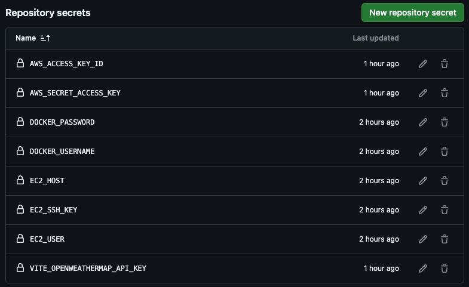
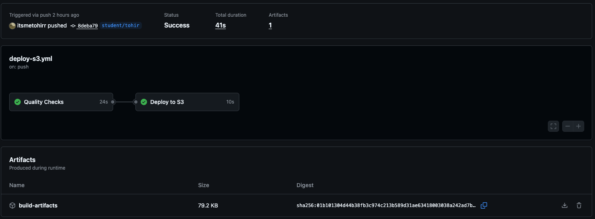

## 🐳 Lab 1: Docker Containerization

**Objective:** Create a production-ready Docker setup for the weather app

#### Task 1.1: Create Multi-Stage Dockerfile

Create a `Dockerfile` that:
- [x] Uses Node.js Alpine image for the build stage
- [x] Builds the React application
- [x] Uses nginx Alpine for the production stage
- [x] Serves the built application
- [x] Exposes port 80


```Dockerfile
FROM node:alpine AS builder

WORKDIR /app

COPY package.json package-lock.json ./
RUN npm install

COPY . .
RUN npm run build


FROM nginx:alpine

RUN rm -rf /usr/share/nginx/html/*

COPY --from=builder /app/dist /usr/share/nginx/html

COPY nginx.conf /etc/nginx/conf.d/default.conf

EXPOSE 80

CMD ["nginx", "-g", "daemon off;"]
```

---
---
<br>

#### Task 1.2: Create Nginx Configuration

Create `nginx.conf` that:
- [x] Handles SPA routing (redirects all routes to index.html)
- [x] Serves static files efficiently
- [x] Sets appropriate MIME types

nginx.conf 

```nginx
server {
    listen 80;
    server_name localhost;

    root /usr/share/nginx/html;
    index index.html;

    location / {
        try_files $uri $uri/ /index.html;
    }

    location ~* \.(js|css|html|png|jpg|jpeg|svg|woff2?)$ {
        try_files $uri =404;
        access_log off;
        expires 1y;
    }

    error_page 404 /index.html;
}
```

#### Task 1.3: Build and Test Container

```bash
docker build -t weather-app .

docker run -p 8080:80 --name weather-app-container weather-app
```
---
---
<br>

### Success Criteria
- [x] Container builds without errors
- [x] Application loads and functions correctly
- [x] All routes work properly (SPA routing)
- [x] Weather search functionality works
- [x] Container size is optimized (multi-stage build)

```bash
root@ip-172-31-45-9:~/project/weather-app# docker images
REPOSITORY    TAG       IMAGE ID       CREATED        SIZE
weather-app   latest    fe3d8484b3b9   20 hours ago   52.7MB
```

```bash
root@ip-172-31-45-9:~# docker ps
CONTAINER ID   IMAGE         COMMAND                  CREATED        STATUS         PORTS                                     NAMES
6d64a90fc028   weather-app   "/docker-entrypoint.…"   21 hours ago   Up 5 minutes   0.0.0.0:8080->80/tcp, [::]:8080->80/tcp   weather-app-container
```
---
---
<br>

Link to working website:  
[ Weather-app ](http://ec2-98-86-58-135.compute-1.amazonaws.com:8080)

### Question/Problems:
No problems 

---
<br>
<br>

---

## 🔧 Lab 2: Code Quality and Testing Setup

#### Task 2.1: Configure ESLint for TypeScript
- [x] Install necessary ESLint packages for TypeScript
- [x] Configure ESLint to check .ts and .tsx files
- [x] Set up rules to report unused disable directives
- [x] Configure maximum warnings threshold
---
<br>

- [x] Install necessary ESLint packages for TypeScript
```bash
npm install --save-dev eslint @eslint/js typescript typescript-eslint
```

- [x] Configure ESLint to check .ts and .tsx files
- [x] Set up rules to report unused disable directives
```ts
import tseslint from "typescript-eslint";
import { defineConfig } from "eslint/config";

export default defineConfig({
  reportUnusedDisableDirectives: true,
  overrides: [
    {
      files: ["**/*.{ts,tsx}"],
      ...tseslint.configs.recommended,
    },
  ],
});
```
- [x] Configure maximum warnings threshold

```json
  "scripts": {
    "lint": "eslint . --max-warnings=10"
    ...
  }
  ```
  ---
  ---
  <br>

#### Task 2.2: Add npm Scripts

- [x] Add these scripts to `package.json`:
- `lint`: Run ESLint on TypeScript files
- `lint:fix`: Run ESLint with auto-fix
- `test`: Run tests using Vitest
- `test:coverage`: Run tests with coverage reporting


```json
  "scripts": {
    "dev": "vite",
    "build": "tsc -b && vite build",
    "preview": "vite preview",
    "lint": "eslint . --max-warnings=10",
    "lint:fix": "eslint . --ext .ts,.tsx --fix",
    "test": "vitest run",
    "test:coverage": "vitest run --coverage"
  }
  ```
---
---
<br>

#### Task 2.3: Set Up Testing Framework
- Install Vitest and React Testing Library
- Configure testing environment
- Set up Jest DOM matchers

---
---
<br>

#### Task 2.4: Create Basic Tests
- Write component rendering tests
- Write API service tests
- Write basic integration tests
- Organize tests in appropriate directories

---
---
<br>

### Success Criteria
- `npm run lint` passes with 0 errors
- `npm run test` passes all tests
- `npm run build` completes successfully
- Test coverage meets reasonable thresholds
<br>

```bash
root@ip-172-31-45-9:~/project/weather-app# npm run lint

> weather-app@0.0.0 lint
> eslint . --max-warnings=10

root@ip-172-31-45-9:~/project/weather-app# 
```

```bash
root@ip-172-31-45-9:~/project/weather-app# npm run test

> weather-app@0.0.0 test
> vitest run


 RUN  v3.2.4 /root/project/weather-app

 ✓ src/__tests__/App.integration.test.tsx (8 tests) 290ms
 ✓ src/components/__tests__/Search.test.tsx (6 tests) 158ms
 ✓ src/components/__tests__/Weather.test.tsx (12 tests) 77ms
 ✓ src/services/__tests__/weatherService.test.ts (8 tests) 17ms

 Test Files  4 passed (4)
      Tests  34 passed (34)
   Start at  05:15:51
   Duration  4.90s (transform 236ms, setup 563ms, collect 710ms, tests 542ms, environment 1.99s, prepare 443ms)

```

```bash
root@ip-172-31-45-9:~/project/weather-app# npm run build

> weather-app@0.0.0 build
> tsc -b && vite build

vite v7.0.6 building for production...
✓ 88 modules transformed.
dist/index.html                   0.46 kB │ gzip:  0.30 kB
dist/assets/index-xt5FHdKE.css    1.24 kB │ gzip:  0.64 kB
dist/assets/index-CKG0TsZP.js   239.01 kB │ gzip: 78.97 kB
✓ built in 2.13s
root@ip-172-31-45-9:~/project/weather-app# 
```


## Question/Problems:
Tests: Is it our responsibility to write those test? <br>
There was an error from lint? Not my problem. What to do? I just skipped the lines :)<br>
Changed all the test files and corresponding code files with Cursor.

---
<br>
<br>

---

## ☁️ Lab 3: AWS S3 Static Website Hosting

#### Task 3.3: Create Terraform Configuration

1. **AWS Provider Configuration:**
   - Set region to "us-east-1"

2. **S3 Bucket Resources:**
   - S3 bucket with unique name (use random_string)
   - Website configuration with index.html
   - Public access block settings
   - Bucket policy for public read access
   - Appropriate tags

3. **Outputs:**
   - Website endpoint URL
   - Bucket name

**Don't forget to disable public acces block**

<br>
<br>
./terraform/main.tf

```terraform
provider "aws" {
  region = "us-east-1"
}

resource "aws_s3_bucket" "my_s3" {
  bucket = "tohirdevopsvention"
}

resource "aws_s3_bucket_website_configuration" "web_conf" {
  bucket = aws_s3_bucket.my_s3.id

  index_document {
    suffix = "index.html"
  }

  error_document {
    key = "error.html"
  }
}

resource "aws_s3_bucket_public_access_block" "public_access" {
  bucket = aws_s3_bucket.my_s3.id

  block_public_acls       = false
  block_public_policy     = false
  ignore_public_acls      = false
  restrict_public_buckets = false
}

resource "aws_s3_bucket_policy" "public_read" {
  bucket = aws_s3_bucket.my_s3.id
  policy = jsonencode({
    Version = "2012-10-17"
    Statement = [
      {
        Sid       = "PublicReadGetObject"
        Effect    = "Allow"
        Principal = "*"
        Action    = "s3:GetObject"
        Resource  = "${aws_s3_bucket.my_s3.arn}/*"
      }
    ]
  })
}

output "website_url" {
  description = "The S3 static website endpoint"
  value       = aws_s3_bucket_website_configuration.web_conf.website_endpoint
}

output "bucket_name" {
  description = "The name of the S3 bucket"
  value       = aws_s3_bucket.my_s3.bucket
}

```
<br>

To see the bucket name:

```bash
terraform output bucket_name
```

To see the website_url:

```bash
terraform output website_url
```

### Success Criteria
- [x] S3 bucket created with static website hosting
- [x] Production build uploaded successfully
- [x] Application accessible via S3 website URL
- [x] All weather functionality works
- [x] Terraform state managed properly
<br>

Bucket website endpoint: <br>
http://tohirdevopsvention.s3-website-us-east-1.amazonaws.com/

## Question/Problems:

Should I just give full `AmazonS3FullAccess`? Or list of accesses?

---
---
<br>
<br>

## 🚀 Lab 4: GitHub Actions CI/CD Pipeline

#### Task 4.1: Create GitHub Actions Workflow

Create `.github/workflows/deploy.yml` with two jobs:

1. **Quality Checks Job:**
   - Trigger on push/PR to main/master branches
   - Setup Node.js environment with caching
   - Install dependencies with `npm ci`
   - Run linting with `npm run lint`
   - Run tests with `npm run test`
   - Build application with `npm run build`
   - Upload build artifacts for deployment job

2. **Deploy Job:**
   - Depend on quality-checks job
   - Only run on main/master branch pushes
   - Download build artifacts
   - Configure AWS credentials
   - Sync files to S3 bucket
<br><br>

```yml
name: CI/CD Pipeline

on:
  push:
    branches: [ student/tohir ]
  pull_request:
    branches: [main, master]

jobs:
  quality-checks:
    name: Quality Checks
    runs-on: ubuntu-latest
    env:
      VITE_OPENWEATHERMAP_API_KEY: ${{ secrets.VITE_OPENWEATHERMAP_API_KEY }}

    steps:
      - name: Checkout code
        uses: actions/checkout@v4

      - name: Setup Node.js with caching
        uses: actions/setup-node@v4
        with:
          node-version: '20'
          cache: 'npm'

      - name: Install dependencies
        run: npm ci

      - name: Run lint
        run: npm run lint

      - name: Run tests
        run: npm run test

      - name: Build application
        run: npm run build

      - name: Upload build artifacts
        uses: actions/upload-artifact@v4
        with:
          name: build-artifacts
          path: ./dist 

  deploy:
    name: Deploy to S3
    runs-on: ubuntu-latest
    needs: quality-checks
    if: github.ref == 'refs/heads/student/tohir' || github.ref == 'refs/heads/master'

    steps:
      - name: Download build artifacts
        uses: actions/download-artifact@v4
        with:
          name: build-artifacts
          path: dist

      - name: Configure AWS credentials
        uses: aws-actions/configure-aws-credentials@v3
        with:
          aws-access-key-id: ${{ secrets.AWS_ACCESS_KEY_ID }}
          aws-secret-access-key: ${{ secrets.AWS_SECRET_ACCESS_KEY }}
          aws-region: us-east-1

      - name: Sync to S3
        run: aws s3 sync dist/ s3://tohirdevopsvention --delete
```

Add these secrets in your GitHub repository settings:
- `AWS_ACCESS_KEY_ID`
- `AWS_SECRET_ACCESS_KEY`
- `AWS_REGION` (us-east-1)
- `S3_BUCKET_NAME`
- `VITE_OPENWEATHERMAP_API_KEY`





#### Task 4.3: Test CI/CD Pipeline

1. Make a small change to the app
2. Commit and push to main/master branch
3. Monitor GitHub Actions workflow
4. Verify deployment to S3
5. Test that failed tests prevent deployment

only works on student/tohir branch


[Link to workflow](https://github.com/itsmetohirr/weather-app/actions/runs/16716687985)

### Success Criteria
- [x] Workflow runs on every push
- [x] Quality checks (linting, testing) must pass before deployment
- [x] Automatic deployment to S3 on main branch
- [x] Failed tests prevent deployment
- [x] Build artifacts are cached for efficiency

---
---

<br>

## 🌐 Lab 5: CloudFront CDN Integration

#### Task 5.1: Create CloudFront Distribution

**Learning Objective:** Add global CDN with HTTPS and Origin Access Control

**Requirements:**
Add to `terraform/main.tf`:

1. **Origin Access Control (OAC):**
   - Create OAC for secure S3 access
   - Configure for S3 origin type
   - Use sigv4 signing protocol

```tf
resource "aws_cloudfront_origin_access_control" "default" {
  name                              = "S3OriginAccessControl"
  description                       = "OAC for S3 bucket"
  origin_access_control_origin_type = "s3"
  signing_behavior                  = "always"
  signing_protocol                  = "sigv4"
}
```

2. **CloudFront Distribution:**
   - Set S3 bucket as origin
   - Enable IPv6 support
   - Set default root object to "index.html"
   - Configure cache behaviors
   - Redirect HTTP to HTTPS
   - Handle SPA routing (404/403 → index.html)

```tf
resource "aws_cloudfront_distribution" "s3_distribution" {
  origin {
    domain_name              = aws_s3_bucket.b.bucket_regional_domain_name
    origin_access_control_id = aws_cloudfront_origin_access_control.default.id
    origin_id                = local.s3_origin_id
  }

  enabled             = true
  is_ipv6_enabled     = true
  default_root_object = "index.html"

  default_cache_behavior {
    allowed_methods  = ["GET", "HEAD"]
    cached_methods   = ["GET", "HEAD"]
    target_origin_id = local.s3_origin_id

    forwarded_values {
      query_string = false

      cookies {
        forward = "none"
      }
    }

    viewer_protocol_policy = "allow-all"
    min_ttl                = 0
    default_ttl            = 3600
    max_ttl                = 86400
  }

  # Cache behavior with precedence 0
  ordered_cache_behavior {
    path_pattern     = "/content/immutable/*"
    allowed_methods  = ["GET", "HEAD", "OPTIONS"]
    cached_methods   = ["GET", "HEAD", "OPTIONS"]
    target_origin_id = local.s3_origin_id

    forwarded_values {
      query_string = false
      headers      = ["Origin"]

      cookies {
        forward = "none"
      }
    }

    min_ttl                = 0
    default_ttl            = 86400
    max_ttl                = 31536000
    compress               = true
    viewer_protocol_policy = "redirect-to-https"
  }

  # Cache behavior with precedence 1
  ordered_cache_behavior {
    path_pattern     = "/content/*"
    allowed_methods  = ["GET", "HEAD", "OPTIONS"]
    cached_methods   = ["GET", "HEAD"]
    target_origin_id = local.s3_origin_id

    forwarded_values {
      query_string = false

      cookies {
        forward = "none"
      }
    }

    min_ttl                = 0
    default_ttl            = 3600
    max_ttl                = 86400
    compress               = true
    viewer_protocol_policy = "redirect-to-https"
  }

  restrictions {
    geo_restriction {
      restriction_type = "none"
    }
  }

  viewer_certificate {
    cloudfront_default_certificate = true
  }
}
```

3. **Updated S3 Bucket Policy:**
   - Replace public access with OAC-only access
   - Allow CloudFront service principal
   - Use source ARN condition

```tf
resource "aws_s3_bucket_policy" "allow_cloudfront" {
  bucket = aws_s3_bucket.b.id

  policy = jsonencode({
    Version = "2012-10-17",
    Statement = [
      {
        Sid       = "AllowCloudFrontServicePrincipalReadOnly",
        Effect    = "Allow",
        Principal = {
          Service = "cloudfront.amazonaws.com"
        },
        Action    = "s3:GetObject",
        Resource  = "${aws_s3_bucket.b.arn}/*",
        Condition = {
          StringEquals = {
            "AWS:SourceArn" = aws_cloudfront_distribution.s3_distribution.arn
          }
        }
      }
    ]
  })
}
```

4. **Outputs:**
   - CloudFront distribution URL

```tf
output "cloudfront_distribution_url" {
  description = "The domain name of the CloudFront distribution"
  value       = aws_cloudfront_distribution.s3_distribution.domain_name
}
```

---
---
<br><br>

#### Task 5.2: Update GitHub Actions

**Learning Objective:** Add CloudFront cache invalidation to CI/CD pipeline

**Requirements:**
Update your GitHub Actions workflow to include:

1. **CloudFront Invalidation Step:**
   - Add step after S3 deployment
   - Use AWS CLI to create invalidation
   - Invalidate all paths (/*)
   - Use distribution ID from secrets

```yml
      - name: Configure AWS credentials
        uses: aws-actions/configure-aws-credentials@v3
        with:
          aws-access-key-id: ${{ secrets.AWS_ACCESS_KEY_ID }}
          aws-secret-access-key: ${{ secrets.AWS_SECRET_ACCESS_KEY }}
          aws-region: us-east-1

      - name: Sync to S3
        run: aws s3 sync dist/ s3://weather-app-tohir --delete

      - name: Invalidate CloudFront cache
        run: |
          aws cloudfront create-invalidation \
            --distribution-id ${{ secrets.CLOUDFRONT_DISTRIBUTION_ID }} \
            --paths "/*"
```

2. **Additional Secrets:**
   - `CLOUDFRONT_DISTRIBUTION_ID`
   - Ensure proper AWS permissions

### Success Criteria
- [x] CloudFront distribution created successfully<br>
  http://d3p55npbehocwb.cloudfront.net
- [x] HTTPS enabled by default
- [x] SPA routing works (404 → index.html)<br>
  http://d3p55npbehocwb.cloudfront.net/notacorrectpath

- [x] Global CDN improves performance
- [x] Cache invalidation works on deployment
---
<br><br>
---


## 📊 Lab 6: Basic Monitoring with CloudWatch


Add to Terraform:

1. **CloudWatch Alarms:**
   - Monitor 4xx error rates
   - Set appropriate thresholds
   - Configure evaluation periods
   - Target CloudFront metrics

```tf
resource "aws_cloudwatch_metric_alarm" "cloudfront_4xx_errors" {
  alarm_name          = "High-4xx-Errors"
  comparison_operator = "GreaterThanOrEqualToThreshold"
  evaluation_periods  = 2
  metric_name         = "4xxErrorRate"
  namespace           = "AWS/CloudFront"
  period              = 300
  statistic           = "Average"
  threshold           = 1.0
  alarm_description   = "Triggered when CloudFront 4xx error rate > 1%"
  dimensions = {
    DistributionId = aws_cloudfront_distribution.s3_distribution.id
    Region         = "Global"
  }
  alarm_actions = [aws_sns_topic.cloudfront_alerts.arn]
  ok_actions    = [aws_sns_topic.cloudfront_alerts.arn]
}

```

2. **SNS Notifications:**
   - Create SNS topic for alerts
   - Set up email subscription
   - Configure alarm actions

```tf
resource "aws_sns_topic" "cloudfront_alerts" {
  name = "cloudfront-alerts"
}

resource "aws_sns_topic_subscription" "email_alert" {
  topic_arn = aws_sns_topic.cloudfront_alerts.arn
  protocol  = "email"
  endpoint  = "itsmetohir@gmail.com"  # 🔁 Replace with your email
}
```

3. **CloudWatch Dashboard:**
   - Create custom dashboard
   - Display key metrics (requests, bytes downloaded)
   - Use time series visualization
   - Monitor CloudFront performance

```tf
resource "aws_cloudwatch_dashboard" "cloudfront_dashboard" {
  dashboard_name = "CloudFrontMonitoring"

  dashboard_body = jsonencode({
    widgets = [
      {
        type = "metric",
        x    = 0,
        y    = 0,
        width  = 12,
        height = 6,
        properties = {
          title = "CloudFront Requests",
          metrics = [
            [ "AWS/CloudFront", "Requests", "DistributionId", aws_cloudfront_distribution.s3_distribution.id, "Region", "Global" ]
          ],
          period = 300,
          stat   = "Sum",
          region = "us-east-1"
        }
      },
      {
        type = "metric",
        x    = 0,
        y    = 6,
        width  = 12,
        height = 6,
        properties = {
          title = "Bytes Downloaded",
          metrics = [
            [ "AWS/CloudFront", "BytesDownloaded", "DistributionId", aws_cloudfront_distribution.s3_distribution.id, "Region", "Global" ]
          ],
          period = 300,
          stat   = "Sum",
          region = "us-east-1"
        }
      },
      {
        type = "metric",
        x    = 0,
        y    = 12,
        width  = 12,
        height = 6,
        properties = {
          title = "4xx Error Rate",
          metrics = [
            [ "AWS/CloudFront", "4xxErrorRate", "DistributionId", aws_cloudfront_distribution.s3_distribution.id, "Region", "Global" ]
          ],
          period = 300,
          stat   = "Average",
          region = "us-east-1"
        }
      }
    ]
  })
}
```
---
<br><br>
---

## 🌍 Lab 7: Custom Domain with Route 53 & SSL (Optional)


#### Task 7.1: Register Domain (Optional)

- [x] Register domain through Route 53 or use existing domain
- [x] Create hosted zone in Route 53

  https://sumai.digital

#### Task 7.2: Create SSL Certificate

1. **ACM Certificate:**
   - Request certificate for your domain
   - Use DNS validation method
   - Must be in us-east-1 region for CloudFront
   - Configure lifecycle rules

```tf
resource "aws_acm_certificate" "sumai_cert" {
  domain_name       = "sumai.digital"
  validation_method = "DNS"

  lifecycle {
    create_before_destroy = true
  }
}
```

2. **DNS Validation:**
   - Create Route 53 records for validation
   - Use for_each loop for multiple domains
   - Set appropriate TTL values
   - Link to hosted zone

```tf
resource "aws_route53_record" "cert_validation" {
  for_each = {
    for dvo in aws_acm_certificate.sumai_cert.domain_validation_options : dvo.domain_name => {
      name   = dvo.resource_record_name
      type   = dvo.resource_record_type
      record = dvo.resource_record_value
    }
  }

  zone_id = data.aws_route53_zone.main.zone_id
  name    = each.value.name
  type    = each.value.type
  ttl     = 60
  records = [each.value.record]
}
```

3. **Certificate Validation:**
   - Wait for DNS validation to complete
   - Reference validation records
   - Ensure certificate is ready for use

```tf
resource "aws_acm_certificate_validation" "cert" {
  certificate_arn         = aws_acm_certificate.sumai_cert.arn
  validation_record_fqdns = [for record in aws_route53_record.cert_validation : record.fqdn]
}
```
4. **CloudFront Integration:**
   - Update CloudFront distribution
   - Use custom SSL certificate
   - Set security policy

```tf
  viewer_certificate {
    acm_certificate_arn            = "arn:aws:acm:us-east-1:162717643867:certificate/423ec233-b106-42d0-8cc2-b95cfa30f56b"
    ssl_support_method             = "sni-only"
    minimum_protocol_version       = "TLSv1.2_2021"
  }
```
   - Configure domain aliases

```tf
  aliases = ["sumai.digital"]
```

Start date: Saturday 2-August<br>
End date: Wednesday 6-August
